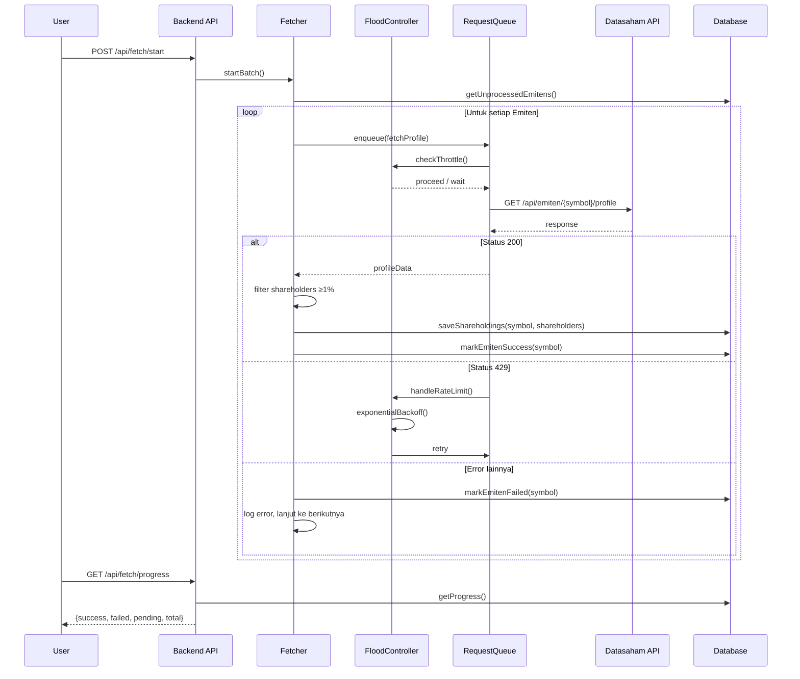
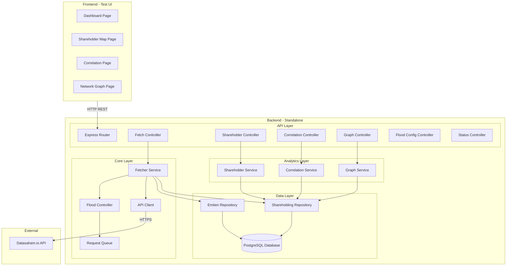
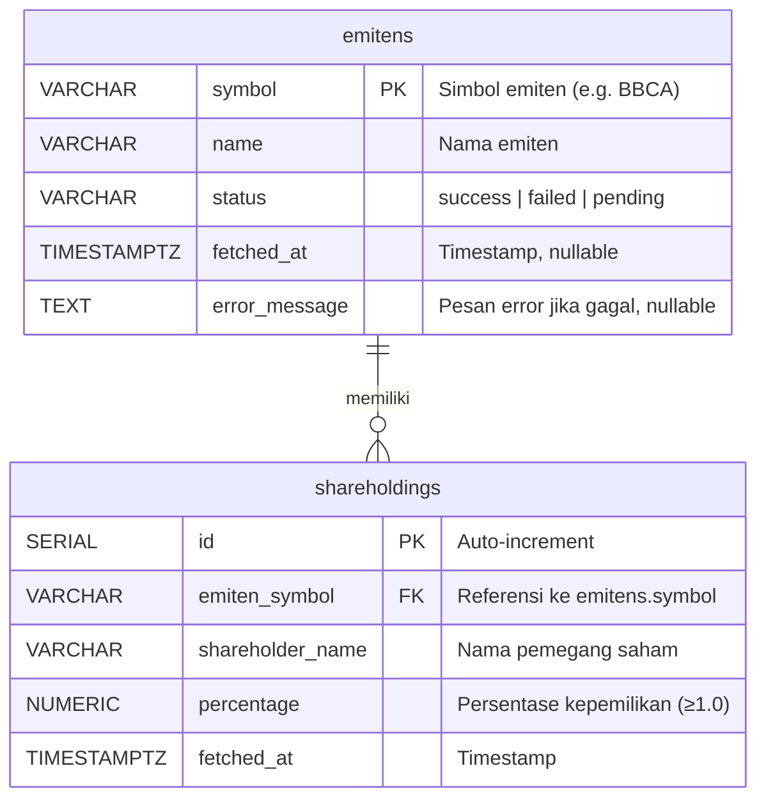

# Dokumen Desain: Shareholder Mapping

## Overview

Sistem Shareholder Mapping adalah aplikasi untuk memetakan hubungan kepemilikan saham di Bursa Efek Indonesia (IDX). Sistem mengambil data profil ~900 emiten dari API Datasaham.io, mengekstrak pemegang saham dengan kepemilikan ≥1%, menyimpan ke database, dan menyediakan API endpoint untuk analitik (peta kepemilikan, korelasi, network graph).

### Keputusan Desain Utama

1. **Backend standalone, frontend hanya testing** — Seluruh logika bisnis ada di backend. Frontend adalah SPA sederhana untuk verifikasi.
2. **Tech stack backend: Node.js + TypeScript + Express + PostgreSQL** — PostgreSQL dipilih untuk mendukung query analitik yang lebih kompleks dan skalabilitas ke depan. Menggunakan `pg` (node-postgres) sebagai driver.
3. **Tech stack frontend: React + TypeScript + Vite** — SPA sederhana dengan D3.js untuk visualisasi network graph.
4. **Anti-flooding sebagai modul terpisah** — `FloodController` mengelola queue, delay, concurrency, backoff, dan pause/resume secara independen dari fetcher logic.
5. **Immediate persistence** — Setiap emiten yang berhasil diproses langsung disimpan ke database, bukan di-batch di akhir.
6. **Property-based testing dengan fast-check** — Untuk memvalidasi correctness properties secara komprehensif.

### Alur Utama



## Architecture

### Arsitektur Tingkat Tinggi



### Struktur Direktori

```
shareholder-mapping/
├── backend/
│   ├── src/
│   │   ├── index.ts                  # Entry point, Express setup
│   │   ├── config.ts                 # Environment variables, defaults
│   │   ├── database/
│   │   │   ├── connection.ts         # PostgreSQL connection setup
│   │   │   ├── migrations.ts         # Schema creation
│   │   │   ├── emiten.repository.ts
│   │   │   └── shareholding.repository.ts
│   │   ├── core/
│   │   │   ├── api-client.ts         # Datasaham API client
│   │   │   ├── flood-controller.ts   # Anti-flooding logic
│   │   │   ├── request-queue.ts      # Request queue management
│   │   │   └── fetcher.ts            # Batch fetch orchestrator
│   │   ├── services/
│   │   │   ├── shareholder.service.ts
│   │   │   ├── correlation.service.ts
│   │   │   └── graph.service.ts
│   │   ├── controllers/
│   │   │   ├── fetch.controller.ts
│   │   │   ├── shareholder.controller.ts
│   │   │   ├── correlation.controller.ts
│   │   │   ├── graph.controller.ts
│   │   │   ├── flood-config.controller.ts
│   │   │   └── status.controller.ts
│   │   └── types.ts                  # Shared TypeScript interfaces
│   ├── tests/
│   │   ├── unit/
│   │   └── property/
│   ├── package.json
│   └── tsconfig.json
├── frontend/
│   ├── src/
│   │   ├── App.tsx
│   │   ├── pages/
│   │   │   ├── Dashboard.tsx
│   │   │   ├── ShareholderMap.tsx
│   │   │   ├── Correlation.tsx
│   │   │   └── NetworkGraph.tsx
│   │   ├── api/
│   │   │   └── client.ts            # Backend API client
│   │   └── components/
│   ├── package.json
│   └── vite.config.ts
└── README.md
```


## Components and Interfaces

### 1. API Client (`api-client.ts`)

Modul untuk berkomunikasi dengan API Datasaham.io.

```typescript
interface ApiClientConfig {
  baseUrl: string;       // https://api.cloudnexify.com
  apiKey: string;        // dari environment variable DATASAHAM_API_KEY
}

interface ApiClient {
  // Mengambil daftar seluruh emiten
  fetchEmitenList(): Promise<EmitenListResponse>;

  // Mengambil profil satu emiten (termasuk data pemegang saham)
  fetchEmitenProfile(symbol: string): Promise<EmitenProfileResponse>;
}
```

### 2. Flood Controller (`flood-controller.ts`)

Modul inti anti-flooding. Mengelola throttling, concurrency, backoff, dan pause/resume.

```typescript
interface FloodControlConfig {
  delayMs: number;          // Delay antar request (default: 1000ms)
  maxConcurrency: number;   // Jumlah request paralel (default: 1)
  maxRetries: number;       // Maksimal retry per request (default: 5)
  initialBackoffMs: number; // Backoff awal untuk 429 (default: 5000ms)
}

interface FloodControlStats {
  totalRequests: number;
  successCount: number;
  failureCount: number;
  retryCount: number;
  avgResponseTimeMs: number;
  consecutive429Count: number;
}

interface FloodController {
  getConfig(): FloodControlConfig;
  updateConfig(partial: Partial<FloodControlConfig>): void;
  getStats(): FloodControlStats;

  // Eksekusi request melalui flood control
  execute<T>(fn: () => Promise<T>): Promise<T>;

  pause(): void;
  resume(): void;
  isPaused(): boolean;

  // Reset stats dan consecutive 429 counter
  resetStats(): void;
}
```

**Keputusan Desain:**
- `execute()` membungkus setiap request dengan delay, concurrency limiter, dan retry logic.
- Consecutive 429 counter di-reset setiap kali ada request sukses.
- Auto-pause saat 3x 429 berturut-turut, memerlukan manual resume.

### 3. Request Queue (`request-queue.ts`)

Antrian request yang bekerja sama dengan FloodController.

```typescript
interface QueueItem<T> {
  id: string;
  fn: () => Promise<T>;
  resolve: (value: T) => void;
  reject: (error: Error) => void;
}

interface RequestQueue {
  enqueue<T>(fn: () => Promise<T>): Promise<T>;
  size(): number;
  clear(): void;
  pause(): void;
  resume(): void;
}
```

**Keputusan Desain:**
- Queue menggunakan array FIFO sederhana.
- `enqueue()` mengembalikan Promise yang resolve saat request selesai dieksekusi.
- Pause/resume pada queue mendelegasikan ke FloodController.

### 4. Fetcher (`fetcher.ts`)

Orkestrator proses batch pengambilan data.

```typescript
interface FetchProgress {
  total: number;
  success: number;
  failed: number;
  pending: number;
  isRunning: boolean;
  isPaused: boolean;
}

interface Fetcher {
  start(): Promise<void>;       // Mulai batch (hanya emiten pending/failed)
  pause(): void;
  resume(): void;
  getProgress(): FetchProgress;
}
```

**Keputusan Desain:**
- `start()` mengambil daftar emiten yang belum diproses atau gagal dari database.
- Setiap emiten diproses satu per satu melalui FloodController.
- Data langsung disimpan ke database setelah setiap emiten berhasil.
- Jika FloodController auto-pause (3x 429), fetcher juga berhenti.

### 5. Shareholder Service (`shareholder.service.ts`)

```typescript
interface ShareholderSummary {
  name: string;
  emitenCount: number;
}

interface ShareholderEmiten {
  symbol: string;
  emitenName: string;
  percentage: number;
}

interface EmitenShareholder {
  shareholderName: string;
  percentage: number;
}

interface CompletenessMetadata {
  processedEmitens: number;
  totalEmitens: number;
}

interface ShareholderService {
  getAllShareholders(search?: string): Promise<{data: ShareholderSummary[], completeness: CompletenessMetadata}>;
  getEmitensByShareholder(name: string): Promise<{data: ShareholderEmiten[], completeness: CompletenessMetadata}>;
  getShareholdersByEmiten(symbol: string): Promise<{data: EmitenShareholder[], completeness: CompletenessMetadata}>;
}
```

### 6. Correlation Service (`correlation.service.ts`)

```typescript
interface CorrelationResult {
  shareholderName: string;
  correlationScore: number;  // Jumlah emiten yang dimiliki bersama
  commonEmitens: string[];
}

interface CorrelationService {
  getCorrelations(shareholderName: string): Promise<{data: CorrelationResult[], warning?: string}>;
  getCommonEmitens(name1: string, name2: string): Promise<{data: ShareholderEmiten[], warning?: string}>;
}
```

**Keputusan Desain:**
- Korelasi dihitung secara on-demand dari database, bukan pre-computed.
- Skor korelasi = jumlah emiten yang dimiliki bersama oleh dua pemegang saham.
- Warning ditambahkan jika data belum lengkap (<900 emiten berhasil).

### 7. Graph Service (`graph.service.ts`)

```typescript
interface GraphNode {
  id: string;
  type: 'emiten' | 'shareholder';
  label: string;
  size: number;  // Jumlah koneksi
}

interface GraphEdge {
  source: string;  // Node ID
  target: string;  // Node ID
  percentage: number;
}

interface GraphService {
  getNodes(minEmitens?: number): Promise<GraphNode[]>;
  getEdges(minEmitens?: number): Promise<GraphEdge[]>;
  getSubgraph(nodeId: string): Promise<{nodes: GraphNode[], edges: GraphEdge[]}>;
}
```

**Keputusan Desain:**
- Node ID untuk emiten: `emiten:{symbol}`, untuk shareholder: `shareholder:{name}`.
- `size` pada node = jumlah edge yang terhubung.
- `minEmitens` memfilter shareholder yang memiliki minimal N emiten.

### 8. Backend API Endpoints

| Method | Endpoint | Controller | Deskripsi |
|--------|----------|------------|-----------|
| GET | `/api/status` | StatusController | Status sistem keseluruhan |
| GET | `/api/flood-control/config` | FloodConfigController | Konfigurasi anti-flooding aktif |
| PUT | `/api/flood-control/config` | FloodConfigController | Ubah konfigurasi anti-flooding |
| POST | `/api/fetch/start` | FetchController | Mulai batch fetch |
| POST | `/api/fetch/pause` | FetchController | Pause batch fetch |
| POST | `/api/fetch/resume` | FetchController | Resume batch fetch |
| GET | `/api/fetch/progress` | FetchController | Progress pengambilan data |
| GET | `/api/shareholders` | ShareholderController | Daftar semua pemegang saham |
| GET | `/api/shareholders/:name/emitens` | ShareholderController | Emiten milik satu pemegang saham |
| GET | `/api/emitens/:symbol/shareholders` | ShareholderController | Pemegang saham satu emiten |
| GET | `/api/shareholders/:name/correlations` | CorrelationController | Korelasi satu pemegang saham |
| GET | `/api/shareholders/:name1/correlations/:name2` | CorrelationController | Emiten bersama dua pemegang saham |
| GET | `/api/graph/nodes` | GraphController | Daftar node graph |
| GET | `/api/graph/edges` | GraphController | Daftar edge graph |
| GET | `/api/graph/subgraph/:nodeId` | GraphController | Subgraph satu node |


## Data Models

### Database Schema (PostgreSQL)



### SQL Schema

```sql
CREATE TABLE IF NOT EXISTS emitens (
    symbol VARCHAR(20) PRIMARY KEY,
    name VARCHAR(255) NOT NULL,
    status VARCHAR(10) NOT NULL DEFAULT 'pending' CHECK(status IN ('success', 'failed', 'pending')),
    fetched_at TIMESTAMPTZ,
    error_message TEXT
);

CREATE TABLE IF NOT EXISTS shareholdings (
    id SERIAL PRIMARY KEY,
    emiten_symbol VARCHAR(20) NOT NULL REFERENCES emitens(symbol) ON DELETE CASCADE,
    shareholder_name VARCHAR(500) NOT NULL,
    percentage NUMERIC(6,2) NOT NULL CHECK(percentage >= 1.0),
    fetched_at TIMESTAMPTZ NOT NULL
);

CREATE INDEX IF NOT EXISTS idx_shareholdings_emiten ON shareholdings(emiten_symbol);
CREATE INDEX IF NOT EXISTS idx_shareholdings_shareholder ON shareholdings(shareholder_name);
CREATE INDEX IF NOT EXISTS idx_emitens_status ON emitens(status);
```

### Keputusan Desain Data Model

1. **`percentage >= 1.0` constraint** — Memastikan hanya pemegang saham dengan kepemilikan ≥1% yang tersimpan, sesuai persyaratan.
2. **`status` pada emitens** — Memungkinkan fetcher untuk melanjutkan dari posisi terakhir (hanya proses `pending` dan `failed`).
3. **Cascade delete** — Jika emiten dihapus, seluruh data kepemilikannya ikut terhapus.
4. **Index pada `shareholder_name`** — Mempercepat query analitik korelasi dan peta kepemilikan.
5. **Refresh strategy** — Saat refresh, data shareholdings lama untuk emiten tersebut dihapus terlebih dahulu, lalu data baru diinsert. Dilakukan dalam satu transaksi.

### Contoh Data

**Tabel `emitens`:**
| symbol | name | status | fetched_at | error_message |
|--------|------|--------|------------|---------------|
| BBCA | Bank Central Asia | success | 2024-01-15T10:30:00Z | null |
| TLKM | Telkom Indonesia | success | 2024-01-15T10:31:00Z | null |
| GOTO | GoTo Gojek Tokopedia | failed | 2024-01-15T10:32:00Z | "404 Not Found" |
| ASII | Astra International | pending | null | null |

**Tabel `shareholdings`:**
| id | emiten_symbol | shareholder_name | percentage | fetched_at |
|----|---------------|------------------|------------|------------|
| 1 | BBCA | FarIndo Investments | 47.15 | 2024-01-15T10:30:00Z |
| 2 | BBCA | Anthony Salim | 2.31 | 2024-01-15T10:30:00Z |
| 3 | TLKM | Pemerintah RI | 52.09 | 2024-01-15T10:31:00Z |
| 4 | TLKM | Public | 47.91 | 2024-01-15T10:31:00Z |

### API Response Shapes

**Datasaham.io Response (GET /api/emiten/{symbol}/profile):**
```json
{
  "symbol": "BBCA",
  "name": "Bank Central Asia Tbk",
  "shareholders": [
    { "name": "FarIndo Investments (Mauritius) Ltd", "percentage": 47.15 },
    { "name": "Anthony Salim", "percentage": 2.31 },
    { "name": "Public", "percentage": 50.54 }
  ]
}
```

**Backend Response (GET /api/shareholders):**
```json
{
  "data": [
    { "name": "Pemerintah RI", "emitenCount": 15 },
    { "name": "FarIndo Investments", "emitenCount": 3 }
  ],
  "completeness": {
    "processedEmitens": 850,
    "totalEmitens": 900
  }
}
```

**Backend Response (GET /api/graph/nodes):**
```json
[
  { "id": "emiten:BBCA", "type": "emiten", "label": "BBCA", "size": 3 },
  { "id": "shareholder:Pemerintah RI", "type": "shareholder", "label": "Pemerintah RI", "size": 15 }
]
```


## Correctness Properties

*Sebuah property adalah karakteristik atau perilaku yang harus berlaku di seluruh eksekusi valid dari sebuah sistem — pada dasarnya, pernyataan formal tentang apa yang seharusnya dilakukan sistem. Property menjembatani antara spesifikasi yang dapat dibaca manusia dan jaminan kebenaran yang dapat diverifikasi mesin.*

### Property 1: Persistensi Daftar Emiten

*For any* daftar emiten yang dikembalikan oleh API Datasaham.io, setelah Fetcher memproses daftar tersebut, seluruh simbol emiten harus tersimpan di database dengan status `pending`.

**Validates: Requirements 1.1, 1.2**

### Property 2: FIFO Order pada Request Queue

*For any* kumpulan request yang di-enqueue ke Request_Queue, request harus dieksekusi dalam urutan FIFO (First In, First Out) yang sama dengan urutan enqueue.

**Validates: Requirements 2.2**

### Property 3: Concurrency Limit

*For any* konfigurasi concurrency N pada Flood_Controller, jumlah request yang sedang berjalan secara bersamaan tidak boleh melebihi N pada waktu kapanpun.

**Validates: Requirements 2.3**

### Property 4: Exponential Backoff pada 429

*For any* urutan response 429 berturut-turut, delay backoff harus berlipat ganda dari `initialBackoffMs` pada setiap percobaan ulang (5s, 10s, 20s, 40s, 80s), dan retry harus berhenti setelah `maxRetries` kali percobaan.

**Validates: Requirements 2.4**

### Property 5: Pause/Resume Round-Trip

*For any* batch yang sedang berjalan, setelah pause lalu resume, proses harus melanjutkan dari posisi terakhir tanpa kehilangan progress dan tanpa memproses ulang emiten yang sudah berhasil.

**Validates: Requirements 2.5, 2.6**

### Property 6: Auto-Pause pada 3x 429 Berturut-turut

*For any* sesi batch, jika terjadi 3 kali error 429 berturut-turut, Flood_Controller harus otomatis melakukan pause. Counter consecutive 429 harus di-reset setiap kali ada request yang berhasil.

**Validates: Requirements 2.7**

### Property 7: Akurasi Statistik Request

*For any* urutan hasil request (sukses, gagal, retry), statistik yang dicatat oleh Flood_Controller harus secara akurat mencerminkan jumlah masing-masing kategori.

**Validates: Requirements 2.8**

### Property 8: Konfigurasi Flood Control Round-Trip

*For any* konfigurasi flood control yang valid, setelah mengubah konfigurasi melalui `updateConfig()`, memanggil `getConfig()` harus mengembalikan konfigurasi yang sama persis.

**Validates: Requirements 2.10**

### Property 9: Filter Pemegang Saham ≥1%

*For any* response profil emiten yang berisi campuran pemegang saham dengan persentase di atas dan di bawah 1%, Fetcher harus mengekstrak hanya pemegang saham dengan persentase ≥1% dan mengabaikan sisanya.

**Validates: Requirements 3.2**

### Property 10: Persistensi Data Kepemilikan

*For any* data kepemilikan yang valid (simbol emiten, nama pemegang saham, persentase ≥1%), setelah disimpan ke database, query terhadap database harus mengembalikan record dengan seluruh field yang lengkap dan nilai yang sama.

**Validates: Requirements 3.3, 4.1**

### Property 11: Error Handling Lanjut ke Emiten Berikutnya

*For any* batch emiten di mana sebagian emiten mengembalikan error, Fetcher harus menandai emiten yang error sebagai `failed` di database dan tetap melanjutkan memproses emiten berikutnya hingga seluruh batch selesai.

**Validates: Requirements 3.4**

### Property 12: Akurasi Progress Tracking

*For any* state database dengan campuran emiten berstatus `success`, `failed`, dan `pending`, query progress harus mengembalikan jumlah yang akurat untuk setiap kategori, dan totalnya harus sama dengan jumlah seluruh emiten.

**Validates: Requirements 4.2, 4.4**

### Property 13: Re-run Hanya Proses Emiten Belum Selesai

*For any* state database di mana sebagian emiten sudah berstatus `success`, menjalankan ulang Fetcher harus hanya memproses emiten dengan status `pending` atau `failed`, tanpa mengambil ulang data emiten yang sudah `success`.

**Validates: Requirements 4.3**

### Property 14: Refresh Mengganti Data Lama

*For any* emiten yang sudah memiliki data kepemilikan di database, saat refresh dilakukan, data lama harus diganti sepenuhnya dengan data baru, dan hanya data baru yang tersisa di database.

**Validates: Requirements 4.5**

### Property 15: Daftar Pemegang Saham dengan Jumlah Emiten Benar

*For any* kumpulan data kepemilikan di database, endpoint `GET /api/shareholders` harus mengembalikan setiap pemegang saham unik dengan `emitenCount` yang sama persis dengan jumlah emiten berbeda yang dimilikinya.

**Validates: Requirements 5.1**

### Property 16: Pengurutan Berdasarkan Persentase Descending

*For any* hasil query pemegang saham atau emiten, data harus terurut berdasarkan persentase kepemilikan dari yang terbesar ke terkecil.

**Validates: Requirements 5.4**

### Property 17: Filter Pencarian

*For any* parameter pencarian `search`, hasil yang dikembalikan harus hanya berisi item yang nama pemegang saham atau simbol emitennya mengandung string pencarian tersebut (case-insensitive).

**Validates: Requirements 5.5**

### Property 18: Metadata Completeness pada Data Belum Lengkap

*For any* state database di mana jumlah emiten berstatus `success` kurang dari total emiten, seluruh endpoint analitik harus menyertakan metadata completeness atau peringatan yang berisi jumlah emiten yang sudah diproses dan total emiten.

**Validates: Requirements 5.6, 6.5**

### Property 19: Korelasi Pemegang Saham

*For any* pemegang saham, endpoint korelasi harus mengembalikan pemegang saham lain yang memiliki saham di emiten yang sama, dengan skor korelasi yang sama persis dengan jumlah emiten yang dimiliki bersama, terurut dari skor tertinggi ke terendah.

**Validates: Requirements 6.1, 6.2, 6.3**

### Property 20: Emiten Bersama Dua Pemegang Saham

*For any* dua pemegang saham, endpoint `GET /api/shareholders/{name1}/correlations/{name2}` harus mengembalikan tepat daftar emiten yang keduanya miliki, tanpa ada yang terlewat atau berlebih.

**Validates: Requirements 6.4**

### Property 21: Graph Nodes dengan Tipe yang Benar

*For any* kumpulan data kepemilikan di database, endpoint `GET /api/graph/nodes` harus mengembalikan satu node per emiten (tipe `emiten`) dan satu node per pemegang saham unik (tipe `shareholder`), dengan `size` yang sama dengan jumlah edge yang terhubung.

**Validates: Requirements 7.1, 7.4**

### Property 22: Graph Edges Sesuai Data Kepemilikan

*For any* kumpulan data kepemilikan di database, endpoint `GET /api/graph/edges` harus mengembalikan satu edge per record kepemilikan dengan source, target, dan persentase yang benar.

**Validates: Requirements 7.2**

### Property 23: Filter min_emitens pada Graph

*For any* nilai `min_emitens` N, hasil graph yang difilter harus hanya menyertakan node pemegang saham yang memiliki minimal N emiten, beserta edge yang terkait. Node emiten tetap disertakan jika terhubung dengan pemegang saham yang lolos filter.

**Validates: Requirements 7.3**

### Property 24: Subgraph Satu Node

*For any* node dalam graph, endpoint `GET /api/graph/subgraph/{node_id}` harus mengembalikan tepat node tersebut beserta seluruh node dan edge yang terhubung langsung dengannya, tanpa node atau edge yang tidak terhubung.

**Validates: Requirements 7.5**


## Error Handling

### Kategori Error

| Kategori | Contoh | Penanganan |
|----------|--------|------------|
| **API Authentication (401)** | API key salah/expired | Hentikan seluruh batch, log pesan "Autentikasi gagal. Periksa konfigurasi API key." |
| **Rate Limited (429)** | Terlalu banyak request | Delegasikan ke FloodController untuk exponential backoff. Auto-pause setelah 3x berturut-turut. |
| **API Error per Emiten (4xx/5xx)** | Emiten tidak ditemukan, server error | Tandai emiten sebagai `failed` di database, catat error message, lanjut ke emiten berikutnya. |
| **API Error Daftar Emiten** | Gagal mengambil daftar emiten | Hentikan proses, log error deskriptif. |
| **Network Error** | Timeout, connection refused | Perlakukan sama seperti error per emiten — tandai `failed`, lanjut. |
| **Database Error** | Disk full, corruption | Log error, hentikan batch. Tidak ada retry otomatis untuk database error. |
| **Invalid Data** | Response API tidak sesuai format | Log warning, tandai emiten sebagai `failed`, lanjut. |

### Strategi Error per Layer

**API Client Layer:**
- Validasi response format sebelum mengembalikan data.
- Throw typed error (`ApiAuthError`, `ApiRateLimitError`, `ApiError`) agar caller dapat membedakan.
- Timeout per request: 30 detik.

**Flood Controller Layer:**
- Tangkap `ApiRateLimitError` dan terapkan exponential backoff.
- Track consecutive 429 count, auto-pause pada 3.
- Reset consecutive counter pada request sukses.

**Fetcher Layer:**
- Tangkap `ApiAuthError` → hentikan seluruh batch.
- Tangkap error lainnya per emiten → tandai `failed`, lanjut.
- Log setiap error dengan konteks (simbol emiten, HTTP status, pesan).

**API Endpoint Layer (Controllers):**
- Validasi input parameter (nama, simbol, konfigurasi).
- Return HTTP 400 untuk input tidak valid.
- Return HTTP 404 untuk resource tidak ditemukan.
- Return HTTP 500 untuk internal error dengan pesan generik (tanpa stack trace).

## Testing Strategy

### Pendekatan Dual Testing

Sistem ini menggunakan dua pendekatan testing yang saling melengkapi:

1. **Unit Tests** — Memverifikasi contoh spesifik, edge case, dan kondisi error.
2. **Property-Based Tests** — Memverifikasi properti universal yang harus berlaku untuk semua input valid.

### Library dan Tools

| Komponen | Library |
|----------|---------|
| Test Runner | Vitest |
| Property-Based Testing | fast-check |
| HTTP Mocking | msw (Mock Service Worker) |
| Database Testing | PostgreSQL test database (atau pg-mem untuk in-memory) |
| Frontend Testing | React Testing Library |

### Konfigurasi Property-Based Testing

- Setiap property test harus menjalankan **minimum 100 iterasi**.
- Setiap property test harus diberi tag komentar yang mereferensikan property di dokumen desain.
- Format tag: `Feature: shareholder-mapping, Property {number}: {property_text}`
- Setiap correctness property harus diimplementasikan oleh **satu** property-based test.

### Struktur Test

```
backend/tests/
├── unit/
│   ├── api-client.test.ts          # Contoh spesifik API call, error handling
│   ├── flood-controller.test.ts    # Edge case: auto-pause, config validation
│   ├── fetcher.test.ts             # Edge case: 401 stops batch, empty list
│   ├── shareholder.service.test.ts # Contoh spesifik query
│   ├── correlation.service.test.ts # Contoh spesifik korelasi
│   ├── graph.service.test.ts       # Contoh spesifik graph generation
│   └── repositories.test.ts       # CRUD operations
├── property/
│   ├── flood-controller.property.test.ts  # Properties 2-8
│   ├── fetcher.property.test.ts           # Properties 1, 9-14
│   ├── shareholder.property.test.ts       # Properties 15-18
│   ├── correlation.property.test.ts       # Properties 19-20
│   └── graph.property.test.ts             # Properties 21-24
frontend/tests/
├── Dashboard.test.tsx              # Unit test: render status, buttons
├── ShareholderMap.test.tsx         # Unit test: search, table render
├── Correlation.test.tsx            # Unit test: form, table render
└── NetworkGraph.test.tsx           # Unit test: graph render, interaction
```

### Unit Test Focus Areas

- **API Client**: Verifikasi header `x-api-key` dikirim (8.1), error 401 menghentikan batch (8.3), endpoint `/api/status` mengembalikan data (8.4).
- **Fetch Endpoints**: Verifikasi endpoint `start`, `pause`, `resume`, `progress` berfungsi (3.6-3.9).
- **Flood Config Endpoint**: Verifikasi `GET` dan `PUT` config (2.9).
- **Frontend Components**: Verifikasi render status, progress, tombol, form, tabel, dan peringatan (9.1-12.8).

### Property Test Focus Areas

Setiap property test menggunakan generator dari fast-check untuk menghasilkan data acak:

- **Emiten generator**: Menghasilkan simbol dan nama emiten acak.
- **Shareholder generator**: Menghasilkan nama pemegang saham dan persentase acak (campuran di atas dan di bawah 1%).
- **Shareholding dataset generator**: Menghasilkan kumpulan data kepemilikan acak dengan multiple emiten dan pemegang saham.
- **FloodControl config generator**: Menghasilkan konfigurasi delay, concurrency, dan retry acak dalam range valid.
- **Request result sequence generator**: Menghasilkan urutan acak hasil request (200, 429, 4xx, 5xx).

### Contoh Property Test

```typescript
// Feature: shareholder-mapping, Property 9: Filter Pemegang Saham ≥1%
test.prop(
  'hanya pemegang saham dengan persentase ≥1% yang diekstrak',
  [shareholderListArbitrary],
  (shareholders) => {
    const result = filterShareholders(shareholders);
    // Semua hasil harus ≥1%
    expect(result.every(s => s.percentage >= 1.0)).toBe(true);
    // Semua shareholder ≥1% dari input harus ada di hasil
    const expected = shareholders.filter(s => s.percentage >= 1.0);
    expect(result).toHaveLength(expected.length);
  },
  { numRuns: 100 }
);
```
